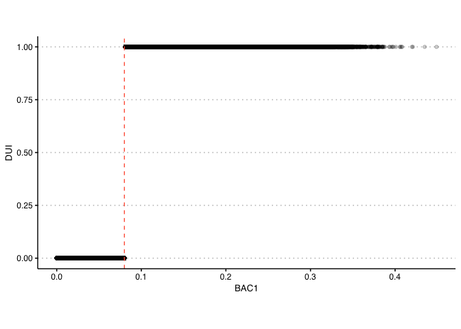
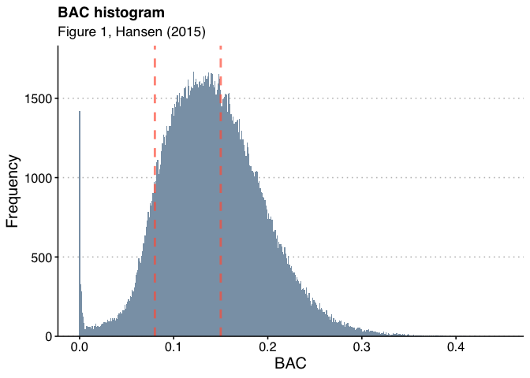

Hansen (2015) RDD Replication
================
Scott Cohn
Last compiled on 03 March, 2021

## Paper Summary

*Briefly summarize this paper. What is his research question? What data
does he use? What is his research design, or “identification strategy”?
What are his conclusions?*

Hansen is interested in determining whether the sanctions on a driving
under the influence (DUI) affect recidivism. The DUI is determined by
the blood alcohol content (BAC). This paper uses administrative records
on a 512,964 DUI stops in Washington state (WA). A BAC above 0.08
denotes a DUI and forms a sharp threshold. Hansen exploits this
threshold in a sharp regression discontinuity design.

This paper finds evidence that having a blood alcohol content about the
DUI threshold reduces rates of recidivism over the next four years.

``` r
library(tidyverse)
library(hrbrthemes)
library(gcookbook)
library(ggthemes)
library(magrittr)
library(modelsummary)
library(sandwich)
library(estimatr)
library(lmtest)
library(rdd)
library(rdrobust)
library(rddensity)
library(knitr)
library(kableExtra)
library(patchwork)
library(broom)
library(tidymodels)
```

``` r
read_data <- function(df)
{
  full_path <- paste("https://raw.githubusercontent.com/scottcohn97/hansen2015_RDD_replication/main/Data/", 
                     df, sep = "")
  df <- read_csv(full_path)
  return(df)
}
```

``` r
# load data
dwi <- read_data("hansen_dwi.csv")

dwi %>% colnames()
```

    ##  [1] "Date"       "Alcohol1"   "Alcohol2"   "low_score"  "male"      
    ##  [6] "white"      "recidivism" "acc"        "aged"       "year"      
    ## [11] "bac1"       "bac2"

## Replication

### Data

*In the United States, an officer can arrest a driver if after giving
them a blood alcohol content (BAC) test they learn the driver had a BAC
of 0.08 or higher. We will only focus on the 0.08 BAC cutoff. We will be
ignoring the 0.15 cutoff for all this analysis. Create a dummy equaling
1 if `bac1` &gt;= 0.08 and 0 otherwise in your do file or R file.*

Here we create the dummy variable.

``` r
dwi <- dwi %>% 
  # create binary for cutoff
  mutate(dui = if_else(bac1 >= 0.08, 1, 0))
```

Next, we check to make sure it was encoded correctly. We do this
visually.

``` r
p_dui <- 
  dwi %>% 
    ggplot(aes(x = bac1, y = dui)) + 
    geom_point(alpha = 0.2) + 
    geom_vline(aes(xintercept = 0.08), linetype = 2, color = "tomato") + 
    labs(x = "BAC1", y = "DUI") + 
    theme_clean() +
    theme(plot.background = element_rect(color = "white")) +
    coord_fixed(ratio = 0.25)

p_dui
```

<!-- -->

This is obviously a sharp regression discontinuity. Next, we want to
create Figure 1.

### Figure 1

*The first thing to do in any RDD is look at the raw data and see if
there’s any evidence for manipulation (“sorting on the running
variable”). If people were capable of manipulating their blood alcohol
content (`bac1`), describe the test we would use to check for this. Now
evaluate whether you see this in these data? Either recreate Figure 1
using the `bac1` variable as your measure of blood alcohol content or
use your own density test from software. Do you find evidence for
sorting on the running variable? Explain your results. Compare what you
found to what Hansen found.*

``` r
fig1 <-
  dwi %>%
    ggplot(aes(x = bac1)) +
    geom_histogram(binwidth = 0.001, fill = "#8aa1b4") +
    geom_vline(aes(xintercept = 0.08), size = 1, linetype = 2,
               color = "tomato", alpha = 0.7) +
    geom_vline(aes(xintercept = 0.15), size = 1, linetype = 2,
               color = "tomato", alpha = 0.7) +
    labs(x = "BAC",
         y = "Frequency",
         title = "BAC histogram",
         subtitle = "Figure 1, Hansen (2015)") +
    scale_y_continuous(expand = expansion(mult = c(0, .1))) +
    theme_clean() + 
    theme(axis.text = element_text(size = 12),
          axis.title = element_text(size = 15),
          title = element_text(size = 15),
          plot.background = element_rect(color = "white"))

fig1
```

<!-- -->

From the distribution of blood alcohol content (BAC), we see little to
no evidence of endogenous sorting. There appears to be no non-random
heaping that might bias the RDD. This aligns exactly with what Hansen
(2015) found.

### Table 2

The second thing we need to do is check for covariate balance. Recreate
Table 2 Panel A but only white male, age and accident (`acc`) as
dependent variables. Use your equation (1) for this. Are the covariates
balanced at the cutoff? It’s okay if they are not exactly the same as
Hansen’s.

Equation 1:

*y*<sub>*i*</sub> = *X*<sub>*i*</sub>′*γ* + *α*<sub>1</sub>DUI<sub>*i*</sub> + *α*<sub>2</sub>BAC<sub>*i*</sub> × DUI<sub>*i*</sub> + *u*<sub>*i*</sub>,

where *y*<sub>*i*</sub> is a measure of recidivism, *X*<sub>*i*</sub> is
a vector of controls, and the BAC variable is rescaled around the
relevant threshold.

``` r
means_bac1 <- 
  dwi %>% 
    mutate(bac1 = round(bac1, 3)) %>%
    filter(bac1 == 0.079) %>%
    summarise(across(c("male", "white", "aged", "acc"), ~ mean(.x, na.rm = T))) %>%
    mutate_if(is.numeric, round, 3) %>%
    identity()

means_bac1 <- cbind(variable = "Mean (at 0.079)", means_bac1)
ctrls <- cbind(variable = "Controls", 
               male = "No", white = "No", aged = "No", acc = "No") 

nrow_means <- 
  dwi %>% 
    mutate(bac1 = round(bac1, 3)) %>%
    filter(bac1 == 0.079) %>%
    nrow()

num_obs <- cbind(variable = "Observations",
                 male = nrow_means, white = nrow_means, 
                 aged = nrow_means, acc = nrow_means)

means_bac1 <- rbind(means_bac1, ctrls, num_obs) 
```

``` r
# optimal bandwidth -- use Imbens/Kalyanaraman bin-widths
# Imbens, Guido and Karthik Kalyanaraman. (2009)
with(dwi, IKbandwidth(X = bac1, Y = recidivism, 
                      cutpoint = 0.08, 
                      kernel = "rectangular", 
                      verbose = TRUE))
```

    ## Imbens-Kalyanamaran Optimal Bandwidth:  0.058

    ## [1] 0.05765752

This optimal bandwidth is pretty close to what was used in the paper.
The differences may be explained by the data not being an exact match
(and the original analysis was done in Stata).

We can run this RDD two ways. First, use the base regression package and
add kernel weights and robust standard errors. Second we use the
`RDestimate` package. The results are analogous.

``` r
# run model
tab2mod <- RDestimate(recidivism ~ bac1 | male + white + aged + acc, 
                        data = dwi, cutpoint = 0.08, 
                        bw = 0.5, 
                        se.type = "HC1",
                        kernel = "rectangular", 
                        cluster = dwi$dui,
                        model = TRUE,
                        frame = FALSE,
                        verbose = FALSE)

# tab2 est
tab2est <- 
  tidy(tab2mod$model[[1]])[5:8,] %>% 
  rownames_to_column() %>%
  gather(variable, value, -rowname) %>%
  spread(rowname, value) %>%
  rename(male = "1", white = "2", aged = "3", acc = "4") 

# join with means
tab2 <- 
  tab2est %>% 
  filter(variable != "term") %>%
  mutate(male = as.numeric(male), white = as.numeric(white), 
         aged = as.numeric(aged), acc = as.numeric(acc)) %>%
  mutate_if(is.numeric, round, 3) %>%
  rbind(means_bac1) %>%
  filter(variable %in% c("estimate", "std.error", 
                         "Mean (at 0.079)", "Controls", "Observations")) %>%
  mutate(variable = if_else(variable == "estimate", "DUI", variable)) %>%
  rename(Characteristics = "variable",
         Male = "male",
         White = "white",
         Age = "aged",
         Accident = "acc") %>%
  kable(caption = "Regression Discontinuity Estimates for the Effect of Exceeding BAC Thresholds on Predetermined Characteristics") %>%
  #kable_styling(latex_options = c("striped"), position = "center") %>%
  kable_classic() %>%
  footnote(general = "This table contains regression discontinuity based estimates of the effect of having BAC above the legal thresholds on predetermined characteristics. Panel A focuses on the estimated effect of BAC above the DUI threshold. The regression has a bandwidth of 0.05 and uses a rectangular kernel for weighting. Based on data from the 1999–2007 Washington State Impaired Driver Program.", threeparttable = T)

tab2
```

<table class=" lightable-classic" style="font-family: &quot;Arial Narrow&quot;, &quot;Source Sans Pro&quot;, sans-serif; margin-left: auto; margin-right: auto;">
<caption>
Regression Discontinuity Estimates for the Effect of Exceeding BAC
Thresholds on Predetermined Characteristics
</caption>
<thead>
<tr>
<th style="text-align:left;">
Characteristics
</th>
<th style="text-align:left;">
Male
</th>
<th style="text-align:left;">
White
</th>
<th style="text-align:left;">
Age
</th>
<th style="text-align:left;">
Accident
</th>
</tr>
</thead>
<tbody>
<tr>
<td style="text-align:left;">
DUI
</td>
<td style="text-align:left;">
0.029
</td>
<td style="text-align:left;">
0.004
</td>
<td style="text-align:left;">
-0.001
</td>
<td style="text-align:left;">
-0.008
</td>
</tr>
<tr>
<td style="text-align:left;">
std.error
</td>
<td style="text-align:left;">
0.002
</td>
<td style="text-align:left;">
0.002
</td>
<td style="text-align:left;">
0
</td>
<td style="text-align:left;">
0.002
</td>
</tr>
<tr>
<td style="text-align:left;">
Mean (at 0.079)
</td>
<td style="text-align:left;">
0.801
</td>
<td style="text-align:left;">
0.864
</td>
<td style="text-align:left;">
33.62
</td>
<td style="text-align:left;">
0.099
</td>
</tr>
<tr>
<td style="text-align:left;">
Controls
</td>
<td style="text-align:left;">
No
</td>
<td style="text-align:left;">
No
</td>
<td style="text-align:left;">
No
</td>
<td style="text-align:left;">
No
</td>
</tr>
<tr>
<td style="text-align:left;">
Observations
</td>
<td style="text-align:left;">
973
</td>
<td style="text-align:left;">
973
</td>
<td style="text-align:left;">
973
</td>
<td style="text-align:left;">
973
</td>
</tr>
</tbody>
<tfoot>
<tr>
<td style="padding: 0; border: 0;" colspan="100%">
<span style="font-style: italic;">Note: </span>
</td>
</tr>
<tr>
<td style="padding: 0; border: 0;" colspan="100%">
<sup></sup> This table contains regression discontinuity based estimates
of the effect of having BAC above the legal thresholds on predetermined
characteristics. Panel A focuses on the estimated effect of BAC above
the DUI threshold. The regression has a bandwidth of 0.05 and uses a
rectangular kernel for weighting. Based on data from the 1999–2007
Washington State Impaired Driver Program.
</td>
</tr>
</tfoot>
</table>

**Hansen (2015):**

For each of the driver demographics, I fail to reject the null that the
predetermined characteristics are unrelated to the BAC cutoffs for DUI
and aggravated DUI.

**Replication:**

For `male`, `white` and `aged` (age), I reject the null that the
predetermined characteristics are unrelated to the BAC cutoffs for DUI.
For `acc`, I fail to reject the null that the predetermined
characteristics are unrelated to the BAC cutoffs for DUI.

### Figure 2 Panels A-D

*Recreate Figure 2 panel A-D. You can use the -cmogram- command in Stata
to do this. Fit both linear and quadratic with confidence intervals.
Discuss what you find and compare it with Hansen’s paper.*

``` r
# Figure 2 Panel A - Accident at scene

# linear
a1 <- 
    dwi %>%
        group_by(bac1) %>%
        mutate(avg_acc = mean(acc),
              dui = if_else(bac1 > 0.15, 2, dui)) %>%
        ggplot(aes(x = bac1, y = avg_acc, color = factor(dui))) + 
        geom_vline(aes(xintercept = 0.08), color = "tomato") +
        geom_vline(aes(xintercept = 0.15), color = "tomato") +
        geom_point(alpha = 0.3, fill = "white") + 
        geom_smooth(method = "lm_robust",
                  formula = y ~ x, se = TRUE) + 
        scale_x_continuous(name = "BAC", limits = c(0, 0.21), 
                           breaks = c(0.05, 0.1, 0.15, 0.2)) + 
        scale_y_continuous(limits = c(0, 0.26), 
                           breaks = c(0.05, 0.1, 0.15, 0.2, 0.25)) + 
        scale_color_manual(values = c("#607d8b", "#607d8b", "#607d8b")) +
        labs(title = "Linear") +
        theme_clean() +
        theme(panel.grid.major.y = element_line(color = "grey", size=0.5),
              plot.background = element_rect(color = "white"),
              axis.text.x = element_text(size = 15),
              axis.title.x = element_text(size = 17),
              axis.text.y = element_text(size = 15),
              axis.title.y = element_blank(),
              legend.position = "None") 

# quadratic
a2 <- 
    dwi %>%
        group_by(bac1) %>%
        mutate(avg_acc = mean(acc),
              dui = if_else(bac1 > 0.15, 2, dui)) %>%
        ggplot(aes(x = bac1, y = avg_acc, color = factor(dui))) + 
        geom_vline(aes(xintercept = 0.08), color = "tomato") +
        geom_vline(aes(xintercept = 0.15), color = "tomato") +
        geom_point(alpha = 0.3, fill = "white") + 
        geom_smooth(method = "lm_robust",
                  formula = y ~ poly(x, 2), se = TRUE) + 
        scale_x_continuous(name = "BAC", limits = c(0, 0.21), 
                           breaks = c(0.05, 0.1, 0.15, 0.2)) + 
        scale_y_continuous(limits = c(0, 0.26), 
                           breaks = c(0.05, 0.1, 0.15, 0.2, 0.25)) + 
        scale_color_manual(values = c("#607d8b", "#607d8b", "#607d8b")) +
        labs(title = "Quadratic") +
        theme_clean() +
        theme(panel.grid.major.y = element_line(color = "grey", size=0.5),
              plot.background = element_rect(color = "white"),
              axis.text.x = element_text(size = 15),
              axis.title.x = element_text(size = 17),
              axis.text.y = element_text(size = 15),
              axis.title.y = element_blank(),
              legend.position = "None")

(a1 + a2) +
  plot_annotation(title = "Panel A. Accident at scene")
```

<!-- -->

``` r
# Figure 2 Panel B - Male

# linear
b1 <- 
    dwi %>%
        group_by(bac1) %>%
        mutate(avg_male = mean(male),
              dui = if_else(bac1 > 0.15, 2, dui)) %>%
        ggplot(aes(x = bac1, y = avg_male, color = factor(dui))) + 
        geom_vline(aes(xintercept = 0.08), color = "tomato") +
        geom_vline(aes(xintercept = 0.15), color = "tomato") +
        geom_point(alpha = 0.3, fill = "white") + 
        geom_smooth(method = "lm_robust",
                  formula = y ~ x, se = TRUE) + 
        scale_x_continuous(name = "BAC", limits = c(0, 0.21), 
                           breaks = c(0.05, 0.1, 0.15, 0.2)) + 
        scale_y_continuous(limits = c(0.73, 0.83), 
                           breaks = c(0.74, 0.76, 0.78, 0.8, 0.82)) + 
        scale_color_manual(values = c("#607d8b", "#607d8b", "#607d8b")) +      
        labs(title = "Linear") +
        theme_clean() + 
        theme(panel.grid.major.y = element_line(color = "grey", size=0.5),
              plot.background = element_rect(color = "white"),
              axis.text.x = element_text(size = 15),
              axis.title.x = element_text(size = 17),
              axis.text.y = element_text(size = 15),
              axis.title.y = element_blank(),
              legend.position = "None")

# quadratic
b2 <-
    dwi %>%
        group_by(bac1) %>%
        mutate(avg_male = mean(male),
              dui = if_else(bac1 > 0.15, 2, dui)) %>%
        ggplot(aes(x = bac1, y = avg_male, color = factor(dui))) + 
        geom_vline(aes(xintercept = 0.08), color = "tomato") +
        geom_vline(aes(xintercept = 0.15), color = "tomato") +
        geom_point(alpha = 0.3, fill = "white") + 
        geom_smooth(method = "lm_robust",
                  formula = y ~ poly(x, 2), se = TRUE) + 
        scale_x_continuous(name = "BAC", limits = c(0, 0.21), 
                           breaks = c(0.05, 0.1, 0.15, 0.2)) + 
        scale_y_continuous(limits = c(0.73, 0.83), 
                           breaks = c(0.74, 0.76, 0.78, 0.8, 0.82)) + 
        scale_color_manual(values = c("#607d8b", "#607d8b", "#607d8b")) +
        labs(title = "Quadratic") +
        theme_clean() + 
        theme(panel.grid.major.y = element_line(color = "grey", size=0.5),
              plot.background = element_rect(color = "white"),
              axis.text.x = element_text(size = 15),
              axis.title.x = element_text(size = 17),
              axis.text.y = element_text(size = 15),
              axis.title.y = element_blank(),
              legend.position = "None")

(b1 + b2) +
    plot_annotation(title = "Panel B. Male")
```

<!-- -->

``` r
# Figure 2 Panel C - Age

c1 <- 
    dwi %>%
        group_by(bac1) %>%
        mutate(avg_age = mean(aged / 100),
              dui = if_else(bac1 > 0.15, 2, dui)) %>%
        ggplot(aes(x = bac1, y = avg_age, color = factor(dui))) + 
        geom_vline(aes(xintercept = 0.08), color = "tomato") +
        geom_vline(aes(xintercept = 0.15), color = "tomato") +
        geom_point(alpha = 0.3, fill = "white") + 
        geom_smooth(method = "lm_robust",
                  formula = y ~ x, se = TRUE) + 
        scale_x_continuous(name = "BAC", limits = c(0, 0.21), 
                           breaks = c(0.05, 0.1, 0.15, 0.2)) + 
        scale_y_continuous(limits = c(0.33, 0.39), 
                           breaks = c(0.34, 0.35, 0.36, 0.37, 0.38)) + 
        scale_color_manual(values = c("#607d8b", "#607d8b", "#607d8b")) +
        labs(title = "Linear") +
        theme_clean() + 
        theme(panel.grid.major.y = element_line(color = "grey", size=0.5),
              plot.background = element_rect(color = "white"),
              axis.text.x = element_text(size = 15),
              axis.title.x = element_text(size = 17),
              axis.text.y = element_text(size = 15),
              axis.title.y = element_blank(),
              legend.position = "None")

c2 <- 
    dwi %>%
        group_by(bac1) %>%
        mutate(avg_age = mean(aged / 100),
              dui = if_else(bac1 > 0.15, 2, dui)) %>%
        ggplot(aes(x = bac1, y = avg_age, color = factor(dui))) + 
        geom_vline(aes(xintercept = 0.08), color = "tomato") +
        geom_vline(aes(xintercept = 0.15), color = "tomato") +
        geom_point(alpha = 0.3, fill = "white") + 
        geom_smooth(method = "lm_robust",
                  formula = y ~ poly(x, 2), se = TRUE) + 
        scale_x_continuous(name = "BAC", limits = c(0, 0.21), 
                           breaks = c(0.05, 0.1, 0.15, 0.2)) + 
        scale_y_continuous(limits = c(0.33, 0.39), 
                           breaks = c(0.34, 0.35, 0.36, 0.37, 0.38)) + 
        scale_color_manual(values = c("#607d8b", "#607d8b", "#607d8b")) +
        labs(title = "Quadratic") +
        theme_clean() + 
        theme(panel.grid.major.y = element_line(color = "grey", size=0.5),
              plot.background = element_rect(color = "white"),
              axis.text.x = element_text(size = 15),
              axis.title.x = element_text(size = 17),
              axis.text.y = element_text(size = 15),
              axis.title.y = element_blank(),
              legend.position = "None")

(c1 + c2) +
  plot_annotation(title = "Panel C. Age")
```

<!-- -->

``` r
# Figure 2 Panel D - White

d1 <-
    dwi %>%
        group_by(bac1) %>%
        mutate(avg_white = mean(white),
              dui = if_else(bac1 > 0.15, 2, dui)) %>%
        ggplot(aes(x = bac1, y = avg_white, color = factor(dui))) + 
        geom_vline(aes(xintercept = 0.08), color = "tomato") +
        geom_vline(aes(xintercept = 0.15), color = "tomato") +
        geom_point(alpha = 0.3, fill = "white") + 
        geom_smooth(method = "lm_robust",
          formula = y ~ x, se = TRUE) + 
        scale_x_continuous(name = "BAC", limits = c(0, 0.21), 
                           breaks = c(0.05, 0.1, 0.15, 0.2)) + 
        scale_y_continuous(limits = c(0.79, 0.91), 
                           breaks = c(0.80, 0.82, 0.84, 0.86, 0.88, 0.90)) +
        scale_color_manual(values = c("#607d8b", "#607d8b", "#607d8b")) +
        labs(title = "Linear") +
        theme_clean() + 
        theme(panel.grid.major.y = element_line(color = "grey", size=0.5),
              plot.background = element_rect(color = "white"),
              axis.text.x = element_text(size = 15),
              axis.title.x = element_text(size = 17),
              axis.text.y = element_text(size = 15),
              axis.title.y = element_blank(),
              legend.position = "None")

d2 <-
    dwi %>%
        group_by(bac1) %>%
        mutate(avg_white = mean(white),
              dui = if_else(bac1 > 0.15, 2, dui)) %>%
        ggplot(aes(x = bac1, y = avg_white, color = factor(dui))) + 
        geom_vline(aes(xintercept = 0.08), color = "tomato") +
        geom_vline(aes(xintercept = 0.15), color = "tomato") +
        geom_point(alpha = 0.3, fill = "white") + 
        geom_smooth(method = "lm_robust",
          formula = y ~ poly(x, 2), se = TRUE) + 
        scale_x_continuous(name = "BAC", limits = c(0, 0.21), 
                           breaks = c(0.05, 0.1, 0.15, 0.2)) + 
        scale_y_continuous(limits = c(0.79, 0.91), 
                           breaks = c(0.80, 0.82, 0.84, 0.86, 0.88, 0.90)) + 
        scale_color_manual(values = c("#607d8b", "#607d8b", "#607d8b")) +
        labs(title = "Quadratic") +
        theme_clean() + 
        theme(panel.grid.major.y = element_line(color = "grey", size=0.5),
              plot.background = element_rect(color = "white"),
              axis.text.x = element_text(size = 15),
              axis.title.x = element_text(size = 17),
              axis.text.y = element_text(size = 15),
              axis.title.y = element_blank(),
              legend.position = "None") 

(d1 + d2)  +
    plot_annotation(title = "Panel D. White")
```

<!-- -->

### Table 3, Col 1, Panel A + B

*Estimate equation (1) with recidivism (`recid`) as the outcome. This
corresponds to Table 3 column 1, but since I am missing some of his
variables, your sample size will be the entire dataset of 214,558.
Nevertheless, replicate Table 3, column 1, Panels A and B. Note that
these are local linear regressions and Panel A uses as its bandwidth
0.03 to 0.13. But Panel B has a narrower bandwidth of 0.055 to 0.105.
Your table should have three columns and two A and B panels associated
with the different bandwidths.:*

1.  *Column 1: control for the `bac1` linearly*
2.  *Column 2: interact `bac1` with cutoff linearly*
3.  *Column 3: interact `bac1` with cutoff linearly and as a quadratic*
4.  *For all analysis, estimate uncertainty using heteroskedastic robust
    standard errors. \[ed: But if you want to show off, use Kolesár and
    Rothe’s 2018 “honest” confidence intervals (only available in R).\]*

``` r
dwi$wtc1 <- kernelwts(dwi$bac1, center = 0.08, bw = 0.5, kernel = "rectangular")

dwi$wtc2 <- kernelwts(dwi$bac1, center = 0.08, bw = 0.25, kernel = "rectangular")
```

#### **Panel A**

Panel A contains estimates with a bandwidth of 0.05, with all
regressions utilizing a rectangular kernel for weighting.

``` r
# column 1 -- control for bac1 linearly

model_3a1 <- lm_robust(recidivism ~ dui + (I(bac1 - .08)) + 
                       year + male + white + aged,
                       data = dwi,
                       subset = wtc1 > 0,
                       weights = wtc1,
                       se_type = "stata", 
                       clusters = dui)

# LATE
tab3col1a1 <- lmtest::coeftest(model_3a1)["dui",] 
```

``` r
# column 2 -- control for bac1 with cutoff linearly

model_3a2 <- lm_robust(recidivism ~ dui + (I(bac1 - .08)) + 
                       dui:I(bac1 - .08) + year + male + white + aged,
                       data = dwi,
                       subset = wtc1 > 0,
                       weights = wtc1,
                       se_type = "stata", 
                       clusters = dui)

# LATE
tab3col1a2 <- lmtest::coeftest(model_3a2)["dui",] 
```

``` r
# column 3 -- interact bac1 with cutoff linearly and as quadratic

model_3a3 <- lm_robust(recidivism ~ dui + (I(bac1 - .08)) + 
                       dui:I(bac1 - .08) + 
                       I((bac1 - .08)^2) + 
                       dui:I((bac1 - .08)^2) +
                       year + male + white + aged,
                       data = dwi, 
                       subset = wtc1 > 0,
                       weights = wtc1,
                       se_type = "stata", 
                       clusters = dui)

# LATE
tab3col1a3 <- lmtest::coeftest(model_3a3)["dui",] 
```

#### **Panel B**

Panel B contains estimates with a bandwidth of 0.025, with all
regressions utilizing a rectangular kernel for weighting.

``` r
model_3b1 <- lm_robust(recidivism ~ dui + (I(bac1 - .08)) + 
                       year + male + white + aged,
                       data = dwi,
                       subset = wtc2 > 0,
                       weights = wtc2,
                       se_type = "stata", 
                       clusters = dui)

# LATE
tab3col1b1 <- lmtest::coeftest(model_3b1)["dui",] 
```

``` r
model_3b2 <- lm_robust(recidivism ~ dui + (I(bac1 - .08)) + 
                       dui:I(bac1 - .08) + year + male + white + aged,
                       data = dwi,
                       subset = wtc2 > 0,
                       weights = wtc2,
                       se_type = "stata", 
                       clusters = dui)

# LATE
tab3col1b2 <- lmtest::coeftest(model_3b2)["dui",] 
```

``` r
model_3b3 <- lm_robust(recidivism ~ dui + (I(bac1 - .08)) + 
                       dui:I(bac1 - .08) + 
                       I((bac1 - .08)^2) + 
                       dui:I((bac1 - .08)^2) +
                       year + male + white + aged,
                       data = dwi, 
                       subset = wtc2 > 0,
                       weights = wtc2,
                       se_type = "stata", 
                       clusters = dui)

# LATE
tab3col1b3 <- lmtest::coeftest(model_3b3)["dui",] 
```

``` r
tab3_panelA <- cbind(tab3col1a1, tab3col1a2, tab3col1a3) %>% round(3) %>% head(2)

tab3_panelA_append <- tibble(
  Mean = c(round(mean(model_3a1$fitted.values),2), 
           round(mean(model_3a2$fitted.values),2), 
           round(mean(model_3a3$fitted.values),2)),
  Controls = "Yes",
  Observations = c(model_3a1$nobs, model_3a2$nobs, model_3a3$nobs)
) %>% t()

tab3_panelA <- rbind(tab3_panelA, tab3_panelA_append)

tab3_panelB <- cbind(tab3col1b1, tab3col1b2, tab3col1b3) %>% round(3) %>% head(2)

tab3_panelB_append <- tibble(
  Mean = c(round(mean(model_3b1$fitted.values),2), 
           round(mean(model_3b2$fitted.values),2), 
           round(mean(model_3b3$fitted.values),2)),
  Controls = "Yes",
  Observations = c(model_3b1$nobs, model_3b2$nobs, model_3b3$nobs)
) %>% t()

tab3_panelB <- rbind(tab3_panelB, tab3_panelB_append)

cbind(tab3_panelA, tab3_panelB) %>% 
  kbl(col.names = c("Control", "Linear", "Quadratic", 
                    "Control", "Linear", "Quadratic"),
      booktabs = T) %>%
  kable_classic() %>%
  footnote(general = "This table contains regression discontinuity based estimates of the effect of having BAC above the DUI threshold on recidivism for all drivers. Panel A contains estimates with a bandwidth of 0.05 while Panel B has a bandwidth of 0.025, with all regressions utilizing a rectangular kernel for weighting. Controls include indicators for county, year, race, gender, and age of the offender. Based on administrative records from the Washington State Impaired Driver Testing Program, 1999–2007. ", threeparttable = T) %>%
  add_header_above(c(" " = 1, 
                     "Panel A. BAC in [0.03, 0.13]" = 3, 
                     "Panel B. BAC in [0.055, 0.105]" = 3)) 
```

<table class=" lightable-classic" style="font-family: &quot;Arial Narrow&quot;, &quot;Source Sans Pro&quot;, sans-serif; margin-left: auto; margin-right: auto;">
<thead>
<tr>
<th style="empty-cells: hide;" colspan="1">
</th>
<th style="padding-bottom:0; padding-left:3px;padding-right:3px;text-align: center; " colspan="3">

<div style="border-bottom: 1px solid #111111; margin-bottom: -1px; ">

Panel A. BAC in \[0.03, 0.13\]

</div>

</th>
<th style="padding-bottom:0; padding-left:3px;padding-right:3px;text-align: center; " colspan="3">

<div style="border-bottom: 1px solid #111111; margin-bottom: -1px; ">

Panel B. BAC in \[0.055, 0.105\]

</div>

</th>
</tr>
<tr>
<th style="text-align:left;">
</th>
<th style="text-align:left;">
Control
</th>
<th style="text-align:left;">
Linear
</th>
<th style="text-align:left;">
Quadratic
</th>
<th style="text-align:left;">
Control
</th>
<th style="text-align:left;">
Linear
</th>
<th style="text-align:left;">
Quadratic
</th>
</tr>
</thead>
<tbody>
<tr>
<td style="text-align:left;">
Estimate
</td>
<td style="text-align:left;">
-0.031
</td>
<td style="text-align:left;">
-0.024
</td>
<td style="text-align:left;">
-0.02
</td>
<td style="text-align:left;">
-0.032
</td>
<td style="text-align:left;">
-0.024
</td>
<td style="text-align:left;">
-0.019
</td>
</tr>
<tr>
<td style="text-align:left;">
Std. Error
</td>
<td style="text-align:left;">
0.002
</td>
<td style="text-align:left;">
0
</td>
<td style="text-align:left;">
0
</td>
<td style="text-align:left;">
0.002
</td>
<td style="text-align:left;">
0
</td>
<td style="text-align:left;">
0
</td>
</tr>
<tr>
<td style="text-align:left;">
Mean
</td>
<td style="text-align:left;">
0.12
</td>
<td style="text-align:left;">
0.12
</td>
<td style="text-align:left;">
0.12
</td>
<td style="text-align:left;">
0.12
</td>
<td style="text-align:left;">
0.12
</td>
<td style="text-align:left;">
0.12
</td>
</tr>
<tr>
<td style="text-align:left;">
Controls
</td>
<td style="text-align:left;">
Yes
</td>
<td style="text-align:left;">
Yes
</td>
<td style="text-align:left;">
Yes
</td>
<td style="text-align:left;">
Yes
</td>
<td style="text-align:left;">
Yes
</td>
<td style="text-align:left;">
Yes
</td>
</tr>
<tr>
<td style="text-align:left;">
Observations
</td>
<td style="text-align:left;">
214558
</td>
<td style="text-align:left;">
214558
</td>
<td style="text-align:left;">
214558
</td>
<td style="text-align:left;">
214163
</td>
<td style="text-align:left;">
214163
</td>
<td style="text-align:left;">
214163
</td>
</tr>
</tbody>
<tfoot>
<tr>
<td style="padding: 0; border: 0;" colspan="100%">
<span style="font-style: italic;">Note: </span>
</td>
</tr>
<tr>
<td style="padding: 0; border: 0;" colspan="100%">
<sup></sup> This table contains regression discontinuity based estimates
of the effect of having BAC above the DUI threshold on recidivism for
all drivers. Panel A contains estimates with a bandwidth of 0.05 while
Panel B has a bandwidth of 0.025, with all regressions utilizing a
rectangular kernel for weighting. Controls include indicators for
county, year, race, gender, and age of the offender. Based on
administrative records from the Washington State Impaired Driver Testing
Program, 1999–2007.
</td>
</tr>
</tfoot>
</table>

### Figure 3

*Recreate the top panel of Figure 3 according to the following rule:*

1.  *Fit linear fit using only observations with less than 0.15 bac on
    the `bac1`*
2.  *Fit quadratic fit using only observations with less than 0.15 bac
    on the `bac1`*

``` r
# kernel weights (rectangular)
dwi$wt_f3B <- kernelwts(dwi$bac1, center = 0.15, bw = 0.002, kernel = "rectangular")
```

``` r
# Panel A. All offenders

# linear
A_all_lin <-
    dwi %>%
        group_by(bac1) %>%
        mutate(avg_rec = mean(recidivism),
                  dui = if_else(bac1 > 0.15, 2, dui)) %>%
        ggplot(aes(x = bac1, y = avg_rec, color = factor(dui))) + 
        geom_vline(aes(xintercept = 0.08), color = "tomato") +
        geom_vline(aes(xintercept = 0.15), color = "tomato") +
        geom_point(alpha = 0.3, fill = "white") + 
        geom_smooth(method = "lm_robust",
              formula = y ~ x, se = TRUE) + 
        scale_x_continuous(name = "BAC", limits = c(0, 0.21), 
                           breaks = c(0.05, 0.1, 0.15, 0.2)) + 
        scale_y_continuous(limits = c(0.07, 0.17), 
                           breaks = c(0.08, 0.1, 0.12, 0.14, 0.16)) + 
        scale_color_manual(values = c("#607d8b", "#607d8b", "#607d8b")) +
        labs(title = "Linear") +
        theme_clean() + 
        theme(panel.grid.major.y = element_line(color = "grey", size=0.5),
              plot.background = element_rect(color = "white"),
              axis.text.x = element_text(size = 15),
              axis.title.x = element_text(size = 17),
              axis.text.y = element_text(size = 15),
              axis.title.y = element_blank(),
              legend.position = "None") +
        coord_fixed()

# quadratic
A_all_quad <-
    dwi %>%
        group_by(bac1) %>%
        mutate(avg_rec = mean(recidivism),
                  dui = if_else(bac1 > 0.15, 2, dui)) %>%
        ggplot(aes(x = bac1, y = avg_rec, color = factor(dui))) + 
        geom_vline(aes(xintercept = 0.08), color = "tomato") +
        geom_vline(aes(xintercept = 0.15), color = "tomato") +
        geom_point(alpha = 0.3, fill = "white") + 
        geom_smooth(method = "lm_robust",
              formula = y ~ poly(x, 2), se = TRUE) + 
        scale_x_continuous(name = "BAC", limits = c(0, 0.21), 
                           breaks = c(0.05, 0.1, 0.15, 0.2)) + 
        scale_y_continuous(limits = c(0.07, 0.17), 
                           breaks = c(0.08, 0.1, 0.12, 0.14, 0.16)) + 
        scale_color_manual(values = c("#607d8b", "#607d8b", "#607d8b")) +
        labs(title = "Quadratic") +
        theme_clean() + 
        theme(panel.grid.major.y = element_line(color = "grey", size=0.5),
              plot.background = element_rect(color = "white"),
              axis.text.x = element_text(size = 15),
              axis.title.x = element_text(size = 17),
              axis.text.y = element_text(size = 15),
              axis.title.y = element_blank(),
              legend.position = "None") +
        coord_fixed()

(A_all_lin + A_all_quad) +
  plot_annotation(title = "Panel A. All offenders")
```

<!-- -->

### Reflecting on exercise

*Discuss what you learned from this exercise. What was the hypothesis
you tested and what did you find? How confident are you in Hansen’s
original conclusion? Why/why not?*

I learned to read documentation for wrapper packages because they are
not always what they seem! This has cemented for me the importance of
understanding the back-end of the code that I am using. I tested whether
whether the sanctions on a driving under the influence (DUI) affect
recidivism. I am confident in Hansen’s results – although we do not have
all of the data. Therefore, I looked at whether my estimates were of the
same sign and similar magnitude.

``` r
sessionInfo()
```

    ## R version 4.0.3 (2020-10-10)
    ## Platform: x86_64-apple-darwin17.0 (64-bit)
    ## Running under: macOS Big Sur 10.16
    ## 
    ## Matrix products: default
    ## BLAS:   /Library/Frameworks/R.framework/Versions/4.0/Resources/lib/libRblas.dylib
    ## LAPACK: /Library/Frameworks/R.framework/Versions/4.0/Resources/lib/libRlapack.dylib
    ## 
    ## locale:
    ## [1] en_US.UTF-8/en_US.UTF-8/en_US.UTF-8/C/en_US.UTF-8/en_US.UTF-8
    ## 
    ## attached base packages:
    ## [1] stats     graphics  grDevices utils     datasets  methods   base     
    ## 
    ## other attached packages:
    ##  [1] yardstick_0.0.7    workflows_0.2.1    tune_0.1.2         rsample_0.0.8     
    ##  [5] recipes_0.1.15     parsnip_0.1.5      modeldata_0.1.0    infer_0.5.4       
    ##  [9] dials_0.0.9        scales_1.1.1       tidymodels_0.1.2   broom_0.7.3       
    ## [13] patchwork_1.1.1    kableExtra_1.2.1   knitr_1.30         rddensity_2.1     
    ## [17] rdrobust_0.99.9    rdd_0.57           Formula_1.2-3      AER_1.2-9         
    ## [21] survival_3.2-7     car_3.0-8          carData_3.0-4      lmtest_0.9-38     
    ## [25] zoo_1.8-8          estimatr_0.26.0    sandwich_3.0-0     modelsummary_0.6.1
    ## [29] magrittr_2.0.1     ggthemes_4.2.0     gcookbook_2.0      hrbrthemes_0.8.0  
    ## [33] forcats_0.5.0      stringr_1.4.0      purrr_0.3.4        readr_1.3.1       
    ## [37] tidyr_1.1.2        tibble_3.0.5       tidyverse_1.3.0    mosaic_1.8.2      
    ## [41] ggridges_0.5.2     mosaicData_0.18.0  ggformula_0.9.4    ggstance_0.3.4    
    ## [45] dplyr_1.0.2        Matrix_1.2-18      ggplot2_3.3.3      lattice_0.20-41   
    ## 
    ## loaded via a namespace (and not attached):
    ##   [1] readxl_1.3.1       backports_1.1.6    lpdensity_2.1     
    ##   [4] systemfonts_0.3.2  tidytext_0.2.5     plyr_1.8.6        
    ##   [7] splines_4.0.3      listenv_0.8.0      crosstalk_1.1.0.1 
    ##  [10] leaflet_2.0.3      SnowballC_0.7.0    TH.data_1.0-10    
    ##  [13] digest_0.6.27      foreach_1.5.0      htmltools_0.4.0   
    ##  [16] fansi_0.4.1        mosaicCore_0.8.0   openxlsx_4.1.5    
    ##  [19] globals_0.14.0     gower_0.2.2        modelr_0.1.7      
    ##  [22] extrafont_0.17     wordcloud_2.6      extrafontdb_1.0   
    ##  [25] colorspace_1.4-1   blob_1.2.1         rvest_0.3.6       
    ##  [28] ggrepel_0.9.1      haven_2.2.0        xfun_0.21         
    ##  [31] crayon_1.3.4       jsonlite_1.7.1     iterators_1.0.12  
    ##  [34] glue_1.4.2         polyclip_1.10-0    gtable_0.3.0      
    ##  [37] ipred_0.9-9        emmeans_1.4.7      webshot_0.5.2     
    ##  [40] Rttf2pt1_1.3.8     abind_1.4-5        mvtnorm_1.1-1     
    ##  [43] DBI_1.1.0          Rcpp_1.0.4.6       viridisLite_0.3.0 
    ##  [46] xtable_1.8-4       GPfit_1.0-8        foreign_0.8-80    
    ##  [49] statquotes_0.2.2   lava_1.6.8.1       prodlim_2019.11.13
    ##  [52] htmlwidgets_1.5.1  httr_1.4.2         RColorBrewer_1.1-2
    ##  [55] ellipsis_0.3.1     pkgconfig_2.0.3    farver_2.0.3      
    ##  [58] nnet_7.3-14        dbplyr_1.4.4       labeling_0.3      
    ##  [61] tidyselect_1.1.0   rlang_0.4.10       DiceDesign_1.8-1  
    ##  [64] munsell_0.5.0      cellranger_1.1.0   tools_4.0.3       
    ##  [67] cli_2.2.0          generics_0.1.0     evaluate_0.14     
    ##  [70] ggdendro_0.1-20    yaml_2.2.1         tables_0.9.4      
    ##  [73] fs_1.4.1           zip_2.0.4          nlme_3.1-149      
    ##  [76] future_1.21.0      xml2_1.3.2         tokenizers_0.2.1  
    ##  [79] compiler_4.0.3     rstudioapi_0.13    curl_4.3          
    ##  [82] reprex_0.3.0       lhs_1.1.1          tweenr_1.0.1      
    ##  [85] stringi_1.5.3      highr_0.8          gdtools_0.2.2     
    ##  [88] vctrs_0.3.4        furrr_0.2.1        pillar_1.4.4      
    ##  [91] lifecycle_0.2.0    estimability_1.3   data.table_1.13.0 
    ##  [94] R6_2.4.1           gridExtra_2.3      rio_0.5.16        
    ##  [97] parallelly_1.23.0  janeaustenr_0.1.5  codetools_0.2-16  
    ## [100] MASS_7.3-53        assertthat_0.2.1   withr_2.2.0       
    ## [103] multcomp_1.4-14    mgcv_1.8-33        parallel_4.0.3    
    ## [106] hms_0.5.3          rpart_4.1-15       grid_4.0.3        
    ## [109] timeDate_3043.102  class_7.3-17       rmarkdown_2.5     
    ## [112] pROC_1.17.0.1      ggforce_0.3.1      lubridate_1.7.8
